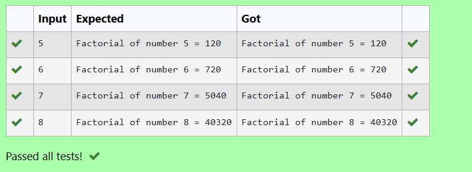

# EX 1A Write a Python Program to print factorial of a number recursively.

## DATE: 28-03-2025

## AIM:

To write a program to create a factorial of a number recursively.

## Algorithm

1. Input a number num from the user.

2. Check if num is less than 0:

- If yes, print "Factorial is not defined for negative numbers."

- If no, proceed to step 4.

3. Define a function factorial(n):

- If n is 0 or 1, return 1.

- Else, return n \* factorial(n - 1) (i.e., call the function recursively).

4. Call the factorial(num) function.

5. Print the result as "Factorial of number {num} = {result}".

## Program:

```python
# Program to implement Reverse a String
# Developed by: Roopak C S
# Register Number: 212223220088

def factorial(n):
    if n == 0 or n == 1:
        return 1
    else:
        return n * factorial(n - 1)

num = int(input())
if num < 0:
    print("Factorial is not defined for negative numbers.")
else:
    print(f"Factorial of number {num} = {factorial(num)}")
```

## Output:



# Result:

The program successfully created a factorial of a number using recursion. When the user provides an input number, the output displays the factorial of the number.
